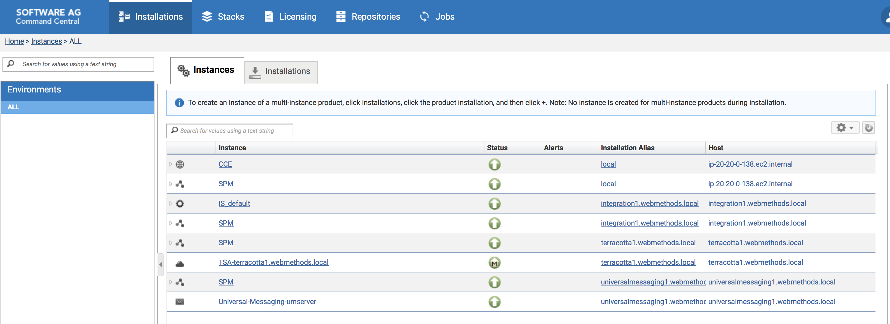

# terraform-webmethods-provisioning

Demo project that leverages terraform and softwareAG Command Central for creating a complete webmethods infrastructure

This project works closely with project [webMethods-devops-provisioning]https://github.com/lanimall/webMethods-devops-provisioning.git which takes care of the actual provisioning of the webMethods products.

The terraform portion will automatically create the infrastructure on AWS, as well as bootstrap the actual webMethods product provisioning outlined in [webMethods-devops-provisioning]https://github.com/lanimall/webMethods-devops-provisioning.git

## Prerequisites

You need:

1. [Terraform](https://www.terraform.io/intro/getting-started/install.html)

    If on MAC, simple install:
    ```
    brew update && brew install terraform
    ```

2. The project should work on any cloud (thanks to Terraform multi-platform ability), but we've tested it on AWS so far.

3. IF testing on AWS:
    - An AWS account, configured with the cli locally
    - An AWS key setup for CLI access
    - If you're setup correctly with AWS, the following AWS CLI Command

    ```
    aws sts get-caller-identity
    ```

## Get the code and initial setup

Run the following commands to get the terraform code, generate the ssh keys we'll need, and fix the permissions on the keys

```
git clone https://github.com/lanimall/terraform-webmethods-provisioning.git
cd ./terraform-webmethods-provisioning
ssh-keygen -b 2048 -t rsa -f ./helper_scripts/id_rsa_bastion -q -N ""
ssh-keygen -b 2048 -t rsa -f ./helper_scripts/id_rsa -q -N ""
chmod 600 ./helper_scripts/id_rsa*
```

Then, add the ssh key to the local agent for easy remote connecting:
```
ssh-add ./helper_scripts/id_rsa_bastion
```

## webMethods Licensing - Preparing the license package

Before running the provisioning, you'll need to ZIP package all the product licenses you have (or plan on using for this demo) so it can be shipped to the TO-BE provisionned Command Central server.

The Terraform variable "webmethods_license_zip_path" will prompt you for the local path to that license ZIP package.
When the Terraform provisioning runs, it will copy the license package to the bastion server 
(FYI: Zip file package will be renamed to "sag_licenses.zip" on the server)

## Automated Provisioning

This is for the fully automated provisioning from A to Z without having to touch the keyboard during...

Simply run the following (use  "-auto-approve" if you want to do it all in one shot)

```bash
terraform init && terraform apply
```

This will do the following automatically:
 - Ask you about different item related to the installation
 - Install all the servers and related artifacts (VPC, security groups, dns, gateways, etc...) on AWS,
 - Update the OS to latest patches / versiions and other misc initial tasks,
 - Install webMethods Command Central on a special "Bastion" server,
 - Configure webMethods Command Central (register licenses, repositories, and specific credentials),
 - Install multiple products per desired outcome / stacks defined in the command central templates. For this demo, it will install the following:
    - webMethods Integration Server 10.3
    - Terracotta Caching Server 10.3
    - webMethods Universal Messaging 10.3

4 main phases are in play:
 - Infrastructure provisioning Phase
 - CCE Install phase
 - CCE Configuration phase
 - CCE Products Install phase

Each of the "CCE" phase can be triggered via Terraform variable at provisioning time.
 - execute_cce_install
 - execute_cce_config
 - execute_cce_products_install

For complete automation, these 3 variables should be set to "true"

As soon as "CCE Install phase" is done, you should be able to access wM Command Central from your favorite browser:
```
open https://$(terraform output bastion-public_ip):8091/cce/web/
```

To track ongoing progress, read on.

### Tracking progress

When the Terraform command ends, the servers have been created and you should see the following final outputs in your terminal.
*BUT it's important to know that actual webMethods product provisioning is still under way (it all runs as background jobs)*
Only after some extra time (several minutes depending on your infrastructure, network, etc...), all will be installed and running as planned.

Terraform command end output signal:

```
Apply complete! Resources: 27 added, 0 changed, 0 destroyed.

Outputs:

ami = ami-02eac2c0129f6376b
amiuser = centos
bastion-private_dns = ip-xx-xx-xx-xx.ec2.internal
bastion-private_ip = xx.xx.xx.xx
bastion-public_ip = xx.xx.xx.xx
webmethods_integration1-private_dns = ip-xx-xx-xx-xx.ec2.internal
webmethods_integration1-private_ip = xx.xx.xx.xx
webmethods_integration1-private_route53_dns = integration1.webmethods.local
webmethods_integration1-public_ip = xx.xx.xx.xx
webmethods_terracotta1-private_dns = ip-xx-xx-xx-xx.ec2.internal
webmethods_terracotta1-private_ip = xx.xx.xx.xx
webmethods_terracotta1-private_route53_dns = terracotta1.webmethods.local
webmethods_terracotta1-public_ip = xx.xx.xx.xx
webmethods_universalmessaging1-private_dns = ip-xx-xx-xx-xx.ec2.internal
webmethods_universalmessaging1-private_ip = xx.xx.xx.xx
webmethods_universalmessaging1-private_route53_dns = universalmessaging1.webmethods.local
webmethods_universalmessaging1-public_ip = xx.xx.xx.xx
```

To check actual progress for the webMethods provisioning:

```
ssh -A $(terraform output amiuser)@$(terraform output bastion-public_ip) "tail -f ~/nohup-bootstrap.log"
```

Once you see the following, it means that the actual provisioning has started and is running in background.

```
...
initial_provisioning_done!!! moving forward...
Executing the CCE installation phase.
CCE installation phase started in background. Check progress at: ~/nohup-bootstrap-cce-install.log
Executing the CCE configuration phase.
CCE configuration phase started in background. Check progress at: ~/nohup-bootstrap-cce-configure.log
Executing the CCE wM Products Installation phase.
CCE wM Products Installation phase started in background. Check progress at: ~/nohup-bootstrap-cce-inventory-install.log
Done!
```

For more details on each of the phases, you can check any of these logs:

 - For CCE Install phase (Phase is completed when you see in the log: "Installation webMethods Command Central is done.")
```
ssh -A $(terraform output amiuser)@$(terraform output bastion-public_ip) "tail -f ~/nohup-bootstrap-cce-install.log"
```

 - For CCE Configuration phase (Phase is completed when you see in the log: "Configuration of webMethods Command Central is done.")
```
ssh -A $(terraform output amiuser)@$(terraform output bastion-public_ip) "tail -f ~/nohup-bootstrap-cce-configure.log"
```

 - For CCE Products Install phase:
```
ssh -A $(terraform output amiuser)@$(terraform output bastion-public_ip) "tail -f ~/nohup-bootstrap-cce-inventory-install.log"
```

And progress for actual command central jobs:

 - webMethods Integration Server:
```
ssh -A $(terraform output amiuser)@$(terraform output bastion-public_ip) "tail -f ~/nohup-wmprovisioning-provision_stack_is_stateless.log"
```

 - Terracotta Caching Server:
```
ssh -A $(terraform output amiuser)@$(terraform output bastion-public_ip) "tail -f ~/nohup-wmprovisioning-provision_stack_tc.log"
```

 - webMethods Universal Messaging:
```
ssh -A $(terraform output amiuser)@$(terraform output bastion-public_ip) "tail -f ~/nohup-wmprovisioning-provision_stack_um.log"
```

### Post Install Steps

*After the full installation is complete*, there are couple of setup items to run as root (mostly to install the products as services)
Let's manually run the post install script on all the newly provisonned servers:

```
cat ./helper_scripts/postinstall-webmethods-node.sh | ssh -A $(terraform output amiuser)@$(terraform output bastion-public_ip) ssh integration1.webmethods.local
cat ./helper_scripts/postinstall-webmethods-node.sh | ssh -A $(terraform output amiuser)@$(terraform output bastion-public_ip) ssh terracotta1.webmethods.local
cat ./helper_scripts/postinstall-webmethods-node.sh | ssh -A $(terraform output amiuser)@$(terraform output bastion-public_ip) ssh universalmessaging1.webmethods.local
```

And that's it!

Integration Server Admin UI is at:
```
open http://$(terraform output webmethods_integration1-public_ip):5555
```

### Extras: Accessing Instances

To administer the newly created servers, you can SSH to the bastion like so:
```
ssh -A $(terraform output amiuser)@$(terraform output bastion-public_ip)
```

From there, you can SSH to any of the servers via their internal DNS name:
```
ssh integration1.webmethods.local
ssh terracotta1.webmethods.local
ssh universalmessaging1.webmethods.local
```

### Extras: Setting variables in Shell

It is possible to have all the Terraform questions "answered" automatically by setting up the right environment variables in your shell...
Check [Terraform Docs about Environment Variables](https://www.terraform.io/docs/commands/environment-variables.html#tf_var_name) for more info.

If you chose to do this, here are the variables you'd need to set for a complete question-less start:
```
export TF_VAR_webmethods_cc_password= <password you want to set for command central ui and all spm communications>
export TF_VAR_webmethods_repo_username= <username to access the empower repo>
export TF_VAR_webmethods_repo_password= <password for empower user>
export TF_VAR_webmethods_license_zip_path= <full path to a softwareag license zip file package>
export TF_VAR_webmethods_integration_license_key_alias= <license key alias for integration server>
export TF_VAR_webmethods_universalmessaging_license_key_alias= <license key alias for universal messaging>
export TF_VAR_webmethods_terracotta_license_key_alias= <license key alias for terracotta>
```

## Semi-Manual provisioning Steps-By-Steps

This is for the semi-manual steps-by-steps...mostly for deeper understanding of the various pieces involved.

### Creating the Infrastructure

Create the infrastructure first (use  "-auto-approve" if you want to do it all in one shot)

```bash
terraform init && terraform apply
```

The key difference from the complete automated provisioning is to set the "phases" variables to false:
 - execute_cce_install = false
 - execute_cce_config = false
 - execute_cce_products_install = false

After a little while, all AWS infrastructure should have been created...BUT no webMethods provisioning was launched.

### Setup Connectivity to the infrastructure

Make sure to add the ssh key to the local agent for easy remote connecting:
```
ssh-add ./helper_scripts/id_rsa_bastion
```

You should then be able to SSH login to the bastion:
```
ssh -A $(terraform output amiuser)@$(terraform output bastion-public_ip)
```

NOTE: Even though you can SSH to the server, the "user-data" server script may still be running in the background 
You can check the provisioning logs on each node...eg. on the bastion:
```
ssh -A $(terraform output amiuser)@$(terraform output bastion-public_ip) "tail -f /var/log/user-data.log"
```

This is for info only...you don't have to wait for user-data to finish to move to the next step...

At this point, the terraform scripts should have copied the necessary files to the bastion server...and 
you should see the following files in the HOME of the "amiuser" by running:

```
ssh $(terraform output amiuser)@$(terraform output bastion-public_ip) "ls -al"
```
 - bootstrap.sh
 - cce-install-configure.sh
 - cce-inventory-install.sh
 - common.sh

### Run webMethods Command Central Installation

Run the Command Central install scripts:

```
ssh -A $(terraform output amiuser)@$(terraform output bastion-public_ip) "/bin/bash bootstrap.sh true false false"
```

NOTE: Be patient...this will take some time...

To check how the script is doing:
```
ssh -A $(terraform output amiuser)@$(terraform output bastion-public_ip) "tail -f ~/nohup-bootstrap-cce-install.log"
```

NOTE:
If you see the following in the progress output: "Initial Server provisioning still in progress...Sleeping for 10 seconds" it means that the server is still being "provisionned" and the script is built to wait for the provioning to be complete before moving forward.

At the end, you should see the following in the logs:
```
...
Installation and Configuration of webMethods Command Central is done.
```

And command central should be running and accessible:
```
open https://$(terraform output bastion-public_ip):8091/cce/web/
```

And you should now be able to login to the UI using the Administrator user and the Password you chose at the beginning of the terraform apply step.

But it will be empty at this point. Go to next section to configure Command Central.

### Run webMethods Command Central Configuration

Run the Command Central install scripts:

```
ssh -A $(terraform output amiuser)@$(terraform output bastion-public_ip) "/bin/bash bootstrap.sh false true false"
```

To check how the script is doing:
```
ssh -A $(terraform output amiuser)@$(terraform output bastion-public_ip) "tail -f ~/nohup-bootstrap-cce-configure.log"
```

Once done, you should now see the following configurations applied and working in Command Central:
- Registered product repository
- Registered fix repository
- Registered licenses
- Registered passwords

### Run webMethods Products Provisioning

From there, we can now run the inventory provisioning:

```
ssh -A $(terraform output amiuser)@$(terraform output bastion-public_ip) "/bin/bash bootstrap.sh false false true"
```

NOTE: Be patient...this will take some time...Command Central at work installing multiple products on multiple servers.

To check how the script is doing:
```
ssh -A $(terraform output amiuser)@$(terraform output bastion-public_ip) "tail -f ~/nohup-bootstrap-cce-inventory-install.log"
```

And progress for actual command central jobs:

 - webMethods Integration Server:
```
ssh -A $(terraform output amiuser)@$(terraform output bastion-public_ip) "tail -f ~/nohup-wmprovisioning-provision_stack_is_stateless.log"
```

 - Terracotta Caching Server:
```
ssh -A $(terraform output amiuser)@$(terraform output bastion-public_ip) "tail -f ~/nohup-wmprovisioning-provision_stack_tc.log"
```

 - webMethods Universal Messaging:
```
ssh -A $(terraform output amiuser)@$(terraform output bastion-public_ip) "tail -f ~/nohup-wmprovisioning-provision_stack_um.log"
```

This is what you should see at the end:



### Post Install

After the installation, there are couple of setup items to run as root... Let's run the post install script on all the newly provisonned servers:

```
cat ./helper_scripts/postinstall-webmethods-node.sh | ssh -A $(terraform output amiuser)@$(terraform output bastion-public_ip) ssh integration1.webmethods.local
cat ./helper_scripts/postinstall-webmethods-node.sh | ssh -A $(terraform output amiuser)@$(terraform output bastion-public_ip) ssh terracotta1.webmethods.local
cat ./helper_scripts/postinstall-webmethods-node.sh | ssh -A $(terraform output amiuser)@$(terraform output bastion-public_ip) ssh universalmessaging1.webmethods.local
```